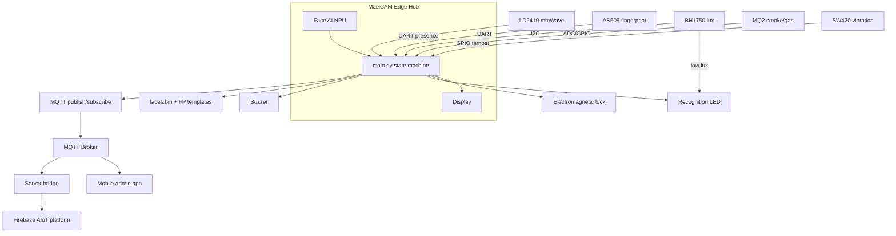
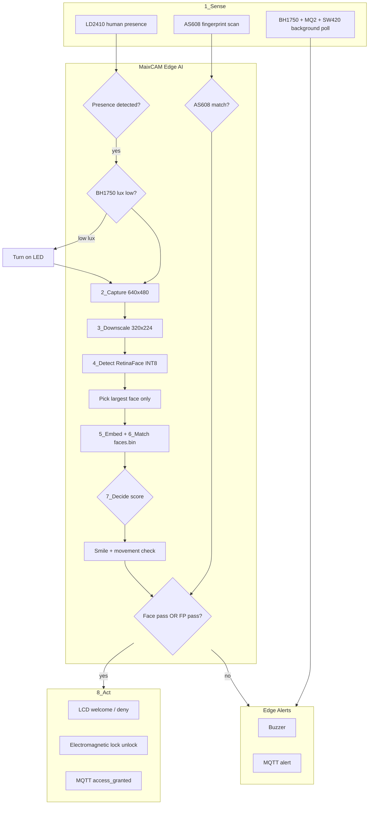
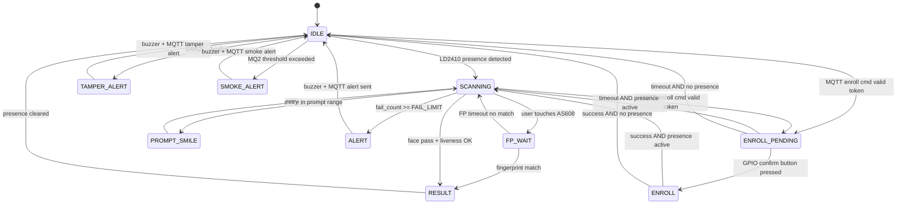

# MaixCAM Smart Door — Edge AIoT Face Recognizer

> Hệ thống cửa thông minh AIoT tích hợp nhận diện khuôn mặt tại edge (MaixCAM NPU), vân tay, cảm biến môi trường và giám sát từ xa — thiết kế cho cuộc thi AIoT.

An edge-first smart door access system built around **MaixCAM** (integrated AI camera + display). All inference, access decisions, and local alerts run on-device; the cloud is an optional mirror for remote monitoring.

---

## Table of Contents

- [Features](#features)
- [System Overview](#system-overview)
- [Hardware Components](#hardware-components)
- [Wiring & Pin Map](#wiring--pin-map)
- [Architecture](#architecture)
- [AI Pipeline](#ai-pipeline)
- [State Machine](#state-machine)
- [Access Control Logic](#access-control-logic)
- [Enrollment & Security](#enrollment--security)
- [MQTT & AIoT Platform](#mqtt--aiot-platform)
- [Project Structure](#project-structure)
- [Getting Started](#getting-started)
- [Configuration](#configuration)
- [Performance Optimization](#performance-optimization)
- [Mobile Admin App](#mobile-admin-app)
- [Contest Narrative (Edge AIoT)](#contest-narrative-edge-aiot)
- [Roadmap](#roadmap)
- [Troubleshooting](#troubleshooting)
- [License](#license)

---

## Features

| Category | Capability |
|----------|------------|
| **Edge AI** | On-device face detection + recognition (RetinaFace + feature model on MaixCAM NPU) |
| **Multi-modal auth** | Unlock via **face OR fingerprint** (AS608) — processed entirely at edge |
| **Presence wake** | LD2410 mmWave radar — human presence gating (no cloud, no ESP32) |
| **Adaptive lighting** | BH1750 lux sensor auto-enables recognition LED in low light |
| **Environmental safety** | MQ2 smoke/gas detection → buzzer + remote alert |
| **Tamper detection** | SW420 vibration sensor → crowbar/pry alert |
| **Smart UX** | On-screen "please smile" prompt when confidence is mid-range |
| **Liveness (basic)** | Smile prompt + frame-to-frame face movement (anti-photo spoof) |
| **Remote enroll** | Admin mobile app → signed MQTT token + physical GPIO button confirm |
| **Remote monitoring** | MQTT + Firebase mirror + mobile app (access log, alerts, sensor dashboard) |
| **Offline-first** | Full unlock + local alerts work without internet; MQTT store-and-forward on reconnect |
| **Fail-safe alerts** | Repeated recognition failures notify admin device |

---

## System Overview

Hệ thống bao gồm **một module MaixCAM** (camera AI + màn hình hiển thị) làm trung tâm điều khiển. Tất cả cảm biến và cơ cấu chấp hành kết nối **trực tiếp** vào MaixCAM qua UART / I2C / GPIO.



---

## Hardware Components

| Thành phần | Component | Vai trò / Role | Giao tiếp → MaixCAM |
|------------|-----------|----------------|---------------------|
| Trung tâm | **MaixCAM** | AI camera, NPU, LCD, WiFi, orchestrator | — |
| Hiện diện | **LD2410** | Radar mmWave phát hiện người | UART |
| Sinh trắc | **AS608** | Cảm biến vân tay — mở khóa dự phòng | UART |
| Ánh sáng | **BH1750** | Đo lux — bật LED nhận diện khi tối | I2C |
| An toàn | **MQ2** | Phát hiện khói / khí gas | ADC hoặc GPIO |
| Chống cạy | **SW420** | Phát hiện rung — cạy phá cửa | GPIO |
| Chấp hành | **Khóa điện từ** | Chốt / mở cửa | GPIO (relay/MOSFET) |
| Chiếu sáng | **LED** | Hỗ trợ nhận diện khuôn mặt | GPIO / PWM |
| Cảnh báo | **Buzzer** | Báo động local | GPIO |
| Xác nhận | **Nút GPIO** | Xác nhận vật lý khi enroll | GPIO input |
| Cloud | **AIoT platform** | MQTT + Firebase + mobile app | WiFi |

### Required models (MaixCAM)

Place on device at `/root/models/`:

| Model | Path | Purpose |
|-------|------|---------|
| RetinaFace (INT8) | `retinaface.mud` | Face detection |
| Face feature (INT8) | `face_feature.mud` | Embedding extraction |

Local face database: `/root/faces.bin`

---

## Wiring & Pin Map

> **Note:** Pin assignments are placeholders — confirm against your specific MaixCAM board schematic before wiring.

| Signal | Interface | MaixCAM pin (TBD) | Notes |
|--------|-----------|-------------------|-------|
| LD2410 TX/RX | UART1 | TX / RX | 256000 baud typical for LD2410 |
| AS608 TX/RX | UART2 | TX / RX | 57600 baud |
| BH1750 SDA/SCL | I2C | SDA / SCL | Address `0x23` or `0x5C` |
| MQ2 output | ADC or GPIO | A0 or GPIO | Calibrate threshold in config |
| SW420 output | GPIO input | GPIO + pull-down | Debounce in software |
| Electromagnetic lock | GPIO output | GPIO via relay/MOSFET | Active time: `UNLOCK_DURATION_S` |
| Recognition LED | GPIO / PWM | GPIO | Auto ON when lux < threshold |
| Buzzer | GPIO output | GPIO | Active HIGH or via transistor |
| Enroll confirm button | GPIO input | PA18 (planned) | Pull-up, momentary to GND |

### Wiring tips

- Use a **relay module** or MOSFET for the electromagnetic lock — do not drive the lock directly from GPIO.
- LD2410 and AS608 each need a dedicated UART — do not share one bus.
- Keep I2C lines (BH1750) short; add 4.7 kΩ pull-ups if not on the breakout board.
- MQ2 requires a **warm-up period** (~24–48 h for stable baseline; pre-heat 60 s minimum in demo).
- Common ground between MaixCAM, sensors, relay, and power supply.

---

## Architecture

### Layer model

```
┌─────────────────────────────────────────────────────────┐
│  Cloud (optional)                                       │
│  MQTT Broker → Server Bridge → Firebase → Mobile App    │
├─────────────────────────────────────────────────────────┤
│  Edge Hub — MaixCAM                                     │
│  ┌─────────────┐  ┌──────────────┐  ┌─────────────────┐ │
│  │ Sensor I/O  │  │ State machine│  │ NPU Face AI     │ │
│  │ LD2410      │→ │ main.py      │← │ RetinaFace+Feat │ │
│  │ AS608       │  │              │  └─────────────────┘ │
│  │ BH1750/MQ2  │  └──────┬───────┘                        │
│  │ SW420       │         │                               │
│  └─────────────┘         ▼                               │
│              Actuators: Lock, LED, Buzzer, LCD           │
│              Storage: faces.bin, FP templates, audit log │
└─────────────────────────────────────────────────────────┘
```

### Data flow (privacy)

| Data | Stays on edge? | Sent to cloud? |
|------|----------------|----------------|
| Camera frames | Yes — never leave device | No |
| Face embeddings | Yes (primary) | Yes — vector only, no images |
| Fingerprint templates | Yes (AS608 flash) | Template ID + metadata only |
| Access events | Yes (audit log) | Yes — via MQTT mirror |
| Sensor telemetry | Yes | Yes — lux, gas_raw, presence |

---

## AI Pipeline



### Pipeline stages

| # | Stage | Description | Edge? |
|---|-------|-------------|-------|
| 1 | **Sense** | LD2410 presence wakes pipeline; AS608 listens in parallel; env sensors poll in background | Yes |
| 2 | **Light adapt** | BH1750 reads lux; enable recognition LED if below `LUX_THRESHOLD` | Yes |
| 3 | **Capture** | Camera at panel-native resolution (640×480) | Yes |
| 4 | **Preprocess** | Downscale to NPU input (320×224); optional hi-res frame on enroll only | Yes |
| 5 | **Detect** | RetinaFace INT8 on NPU; select **largest face only** | Yes (NPU) |
| 6 | **Embed + Match** | Feature vector + cosine match vs `faces.bin` | Yes (NPU) |
| 7 | **Decide** | Pass / smile prompt / fail; liveness check | Yes |
| 8 | **Auth** | Unlock if **face pass OR fingerprint match** | Yes |
| 9 | **Act** | Lock pulse + LCD + MQTT `access_granted` | Yes + notify |
| 10 | **Enroll** | Signed MQTT token + GPIO button → save local → cloud mirror | Yes primary |
| 11 | **Env alerts** | SW420 tamper / MQ2 smoke → buzzer + MQTT (independent of face pipeline) | Yes |

### Recognition thresholds

| Parameter | Default | Meaning |
|-----------|---------|---------|
| `PASS_THRESHOLD` | 0.85 | Cosine score ≥ this → recognized (green) |
| `PROMPT_FLOOR` | 0.50 | Score in [0.50, 0.85) → show "please smile / move closer" |
| Below `PROMPT_FLOOR` | — | Unknown / fail (red) |
| Detect threshold | 0.50 | RetinaFace detection confidence |
| IOU threshold | 0.45 | NMS overlap |

---

## State Machine



After enrollment cancel or success, the system returns to `SCANNING` if LD2410 still detects presence, otherwise `IDLE`.

---

## Access Control Logic

### Unlock path (OR)

Access is granted when **either**:

1. **Face recognized** — largest face, score ≥ `PASS_THRESHOLD`, liveness OK (smile + movement), **OR**
2. **Fingerprint matched** — AS608 identifies enrolled template

On success:
- Pulse **electromagnetic lock** for `UNLOCK_DURATION_S` (e.g. 3 s)
- Show name / welcome on **LCD**
- Publish MQTT `access_granted`
- Reset `fail_count`

On failure:
- Lock stays engaged
- Red overlay on LCD
- Increment `fail_count`; after `FAIL_LIMIT` → buzzer + MQTT alert

### Multi-face policy

If multiple faces are detected, process the **largest bounding box** (`w × h`) only. Optionally display "one person only" if a second large face is present.

### Liveness (basic anti-spoof)

Before face unlock:
1. If score was in prompt range, user must satisfy smile / reposition prompt.
2. Face bounding box must show **minimum movement** between consecutive frames (detects static photo).

No additional NPU model required — contest-friendly trade-off between security and FPS.

---

## Enrollment & Security

Enrollment is the highest-privilege operation. Controls:

| Control | Description |
|---------|-------------|
| **Signed one-time token** | Admin app sends HMAC/JWT bound to `device_id + person_id + expiry` |
| **Physical GPIO confirm** | Admin must press button on device — remote command alone cannot enroll |
| **Enrollment timeout** | Auto-cancel after `ENROLL_TIMEOUT_S` (e.g. 30 s) without button press |
| **MQTT TLS + auth** | Broker requires credentials; device subscribes only to its own topics |
| **Audit log** | Append-only local log of all enroll attempts |
| **Rate limit** | Max N enroll attempts per hour |

### Enrollment flow

```
Admin app → signed MQTT cmd/enroll
    → MaixCAM validates token
    → ENROLL_PENDING: "Stand still — press button to confirm"
    → Admin presses GPIO button
    → Capture face → add_face() → save_faces()
    → Publish facedata (embedding vector, no image)
    → Optional: cmd/enroll_fp for AS608 fingerprint
    → Server bridge mirrors to Firebase
```

### Face enroll vs fingerprint enroll

| Type | Trigger | Storage |
|------|---------|---------|
| Face | `cmd/enroll` + button | `/root/faces.bin` |
| Fingerprint | `cmd/enroll_fp` | AS608 module flash + local index |

---

## MQTT & AIoT Platform

### Topic map

| Topic | Direction | Payload (summary) |
|-------|-----------|-------------------|
| `maixcam/{id}/cmd/enroll` | App → Device | `{person_id, name, token, expires_at}` |
| `maixcam/{id}/cmd/enroll_fp` | App → Device | `{person_id, token, expires_at}` |
| `maixcam/{id}/facedata` | Device → Cloud | `{person_id, name, vector[], ts, device_id}` |
| `maixcam/{id}/status` | Device → App | Enroll result, device health |
| `maixcam/{id}/access_granted` | Device → App | `{person_id, name, score, method, ts}` |
| `maixcam/{id}/alert` | Device → App | `{reason, fail_count?, ts}` — `recognition_failure`, `tamper`, `smoke` |
| `maixcam/{id}/telemetry` | Device → Cloud | `{lux, gas_raw, presence, ts}` |

### Alert reasons

| Reason | Trigger |
|--------|---------|
| `recognition_failure` | `fail_count >= FAIL_LIMIT` |
| `tamper` | SW420 vibration above threshold |
| `smoke` | MQ2 above gas threshold |

### Server bridge

Python service (`server/bridge.py`) subscribes to device topics and writes to **Firebase Firestore**:

| Collection | Document | Fields |
|------------|----------|--------|
| `faces/{person_id}` | per person | `name`, `vector`, `deviceId`, `updatedAt` |
| `access_logs/{id}` | per event | `person_id`, `method`, `score`, `ts` |
| `alerts/{id}` | per alert | `reason`, `deviceId`, `ts` |
| `telemetry/{id}` | periodic | `lux`, `gas_raw`, `presence` |

### Offline store-and-forward

When MQTT broker is unreachable, facedata / alerts / telemetry buffer to a local queue file on MaixCAM and flush automatically on reconnect. Edge operations (unlock, buzzer) are never blocked by network loss.

---

## Project Structure

```
maix-camera-face-regognizer/
├── FaceRecognise.py          # Legacy prototype (single-file demo)
├── maixcam/                  # Edge application (planned)
│   ├── main.py               # Multi-sensor state machine
│   ├── config.py             # Pin map, thresholds, MQTT topics
│   ├── presence.py           # LD2410 mmWave UART driver
│   ├── fingerprint.py        # AS608 UART driver
│   ├── sensors.py            # BH1750, MQ2, SW420
│   ├── actuators.py          # Lock, LED, buzzer
│   ├── recognizer.py         # nn.FaceRecognizer wrapper
│   ├── gpio_input.py         # Enroll confirm button
│   ├── mqtt_client.py        # MQTT + offline queue
│   └── ui.py                 # LCD overlays
├── server/
│   └── bridge.py             # MQTT → Firebase bridge
├── mobile/                   # Flutter / React Native admin app
├── requirements.txt          # Python deps (server/bridge)
└── README.md                 # This file
```

---

## Getting Started

### Prerequisites

**MaixCAM device**
- MaixPy v4 firmware flashed
- WiFi configured
- Models: `retinaface.mud`, `face_feature.mud` in `/root/models/`

**Server (optional — cloud mirror)**
- Python 3.10+
- MQTT broker (e.g. Mosquitto with TLS)
- Firebase project + service account JSON

**Mobile app (optional — remote admin)**
- Flutter or React Native dev environment

### Install — MaixCAM (edge)

1. Copy the `maixcam/` folder to the device (e.g. `/root/app/`).
2. Install `paho-mqtt` on MaixCAM if not bundled.
3. Edit `maixcam/config.py` — set `DEVICE_ID`, broker host, pin map, thresholds.
4. Run:

```bash
python /root/app/maixcam/main.py
```

### Install — Server bridge

```bash
cd server
pip install -r ../requirements.txt
export GOOGLE_APPLICATION_CREDENTIALS=/path/to/firebase-sa.json
python bridge.py
```

### Run legacy prototype

The current repo includes a minimal working demo:

```bash
python FaceRecognise.py
```

This runs face recognition in a loop with motion gating stubbed (`motion_sensor = 1`). Replace with the full `maixcam/` pipeline for production.

---

## Configuration

Key values in `maixcam/config.py` (planned):

```python
# Device identity
DEVICE_ID = "door-001"

# Recognition
PASS_THRESHOLD = 0.85
PROMPT_FLOOR = 0.50
FAIL_LIMIT = 5
ALERT_COOLDOWN_S = 60

# Resolution
CAPTURE_W, CAPTURE_H = 640, 480
DETECT_W, DETECT_H = 320, 224
INFER_EVERY_N = 2          # Frame-skip for FPS

# Sensors
LUX_THRESHOLD = 50         # BH1750 — turn on LED below this
GAS_THRESHOLD = 800        # MQ2 ADC raw (calibrate!)
TAMPER_DEBOUNCE_MS = 200

# Actuators
UNLOCK_DURATION_S = 3
ENROLL_TIMEOUT_S = 30

# Storage
DB_PATH = "/root/faces.bin"
AUDIT_LOG_PATH = "/root/audit.log"
OFFLINE_QUEUE_PATH = "/root/mqtt_queue.json"

# MQTT
MQTT_BROKER = "mqtt.example.com"
MQTT_PORT = 8883
MQTT_USE_TLS = True
```

---

## Performance Optimization

| Technique | Benefit |
|-----------|---------|
| Decouple capture / detect / display resolution | Sharp LCD preview + faster NPU |
| INT8 quantized `.mud` models | Native NPU acceleration |
| `dual_buff=True` on FaceRecognizer | Pipelined inference |
| Frame-skip (`INFER_EVERY_N`) | Higher display FPS; reuse last boxes |
| LD2410 presence gating | Skip inference when no one present |
| Largest-face-only policy | Reduce per-frame work |

Optional on-screen FPS counter (config-gated) for contest benchmarking.

---

## Mobile Admin App

Full-scope mobile app (Flutter / React Native):

| Screen | Function |
|--------|----------|
| Device list | Manage multiple MaixCAM doors |
| Enroll | Send signed face / fingerprint enroll commands |
| Access log | History of `access_granted` events |
| Alerts | Live tamper, smoke, recognition-failure notifications |
| Sensor dashboard | Lux, gas, presence telemetry |

Connects via MQTT (real-time) + Firebase (historical data).

---

## Contest Narrative (Edge AIoT)

Talking points for judges:

1. **All intelligence at the edge** — face AI on MaixCAM NPU; no camera frames sent to cloud.
2. **Multi-modal edge auth** — face OR fingerprint; decisions in milliseconds without server round-trip.
3. **Privacy by design** — only embedding vectors and template IDs leave the device, never raw biometrics images.
4. **Environmental edge sensing** — smoke, tamper, and lux handled locally with instant buzzer response.
5. **Offline-first** — door unlocks and local alarms work without internet.
6. **Secure enrollment** — dual authorization: cloud-signed token + physical button at device.
7. **Efficiency** — presence-gated wake, quantized models, frame-skip — optimized for embedded hardware.

---

## Roadmap

- [x] Legacy face recognition prototype (`FaceRecognise.py`)
- [x] Architecture & pipeline design
- [ ] Modular `maixcam/` edge application
- [ ] LD2410, AS608, BH1750, MQ2, SW420 drivers
- [ ] Actuators: lock, LED, buzzer
- [ ] MQTT client + offline queue
- [ ] Secure enrollment (token + GPIO button)
- [ ] Server bridge → Firebase
- [ ] Mobile admin app
- [ ] Performance tuning + FPS benchmarks
- [ ] Final wiring documentation with confirmed pin map

---

## Troubleshooting

| Symptom | Possible cause | Fix |
|---------|----------------|-----|
| No face detected | Poor lighting | Check BH1750; verify LED turns on |
| Low FPS | Full-res inference | Enable frame-skip; lower DETECT resolution |
| LD2410 no presence | UART wiring / baud | Verify TX/RX not swapped; baud 256000 |
| AS608 no response | Wrong UART / baud | Default 57600; check power (3.3 V / 5 V per module) |
| MQ2 always triggered | Not warmed up | Pre-heat 60 s+; recalibrate `GAS_THRESHOLD` |
| SW420 false alarms | Vibrations in environment | Increase debounce; adjust mounting |
| Lock not opening | Relay wiring | Verify GPIO → relay → lock; check `UNLOCK_DURATION_S` |
| MQTT not connecting | TLS / credentials | Check broker host, port 8883, username/password |
| Enroll fails | Token expired | Resend enroll cmd; press button within timeout |
| "Unknown" for enrolled face | Score below threshold | Re-enroll; lower light; adjust `PASS_THRESHOLD` carefully |

---

## License

TBD — add project license before public release.

---

## Contributing

1. Fork the repository.
2. Create a feature branch (`git checkout -b feature/my-feature`).
3. Commit changes with clear messages.
4. Open a Pull Request describing hardware tested and MaixCAM board model used.

---

## References

- [MaixPy v4 Documentation](https://wiki.sipeed.com/maixpy/)
- [LD2410 mmWave Sensor](https://www.hlktech.net/index.php?id=1113)
- [AS608 Fingerprint Module](https://cdn-shop.adafruit.com/datasheets/27918finger.pdf)
- [BH1750 Light Sensor](https://www.revspace.nl/BH1750)
- [MQTT Protocol](https://mqtt.org/)
- [Firebase Firestore](https://firebase.google.com/docs/firestore)
